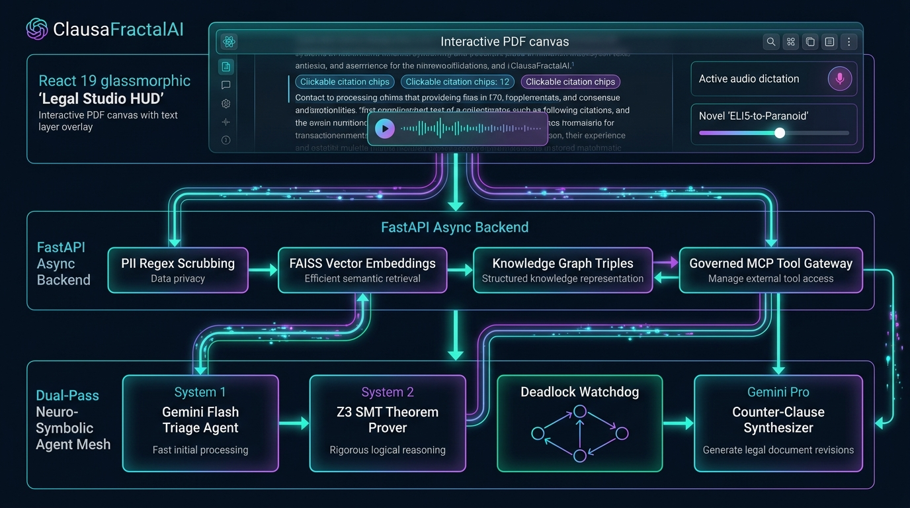
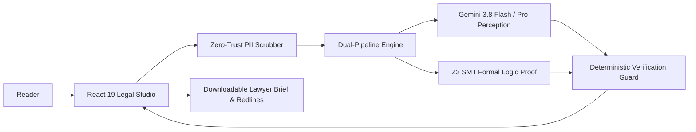

# ClausaFractalAI

> **Make sense of the fine print.** An evidence-grounded assistant for **AI for Legal Assistance & Access**: understand, compare, and navigate legal documents.  
> *Powered by Google Gemini 3.8 (Flash & Pro) on Vertex AI, Dual-Pipeline Neuro-Symbolic Verification (Z3 SMT), and a React 19 Interactive Legal Studio.*

[](https://github.com/sivasubramanian86/ClausaFractalAI/actions)
[](backend/tests/)
[](https://cloud.google.com/run)
[](https://cloud.google.com/vertex-ai)
[](SECURITY.md)
[](frontend/src/components/)
[](LICENSE)

---

## Live Demo

[Open ClausaFractalAI](https://clausafractalai.web.app) · [Public repository](https://github.com/sivasubramanian86/ClausaFractalAI) · [Backend API Docs](https://clausafractalai-backend-967518492968.us-central1.run.app/docs)

The guided sample requires no API key. Live inference uses Google Cloud Vertex AI with zero-key Application Default Credentials (ADC).

Try the sample legal agreement walkthrough in about two minutes:
1. Open the **Document Viewer** to inspect the sample agreement with synchronous PDF highlight coordinates.
2. Select your reading level with the **Complexity Tuner** (`ELI5` ➔ `Standard` ➔ `Counsel` ➔ `Paranoid`) to demystify complex terms into plain English.
3. Open **Policy Collider (Compare versions)** to inspect adverse amendments, shifted liabilities, and surrendered rights between original and revised contracts.
4. Open the **Copilot Q&A** to ask questions (e.g., *"What are my termination obligations?"*) and view live SSE streaming answers with exact page citations.
5. Open the **Attorney Consultation Prep Sheet** to generate a structured, downloadable briefing checklist and counter-clauses to take to a legal professional.

---

## Problem Statement Alignment

| ID | Requirement | ClausaFractalAI Implementation | User & Accessibility Benefit |
|:---|:---|:---|:---|
| **R1** | **Simplifying complex legal documents** | **Multi-Tier Plain-Language Tuner (`ELI5` ➔ `Counsel`)** translating dense clauses into accessible English with verbatim source citations. | Demystifies dense legalese for non-lawyers, tenants, and SMBs while preserving legal precision. |
| **R2** | **Comparing contracts, agreements, or policies** | **Policy Collider side-by-side diff matrix** detecting adverse amendments, surrendered rights, and shifted liabilities between agreement versions. | Instantly reveals one-sided clauses and policy deviations across contract renewals and counter-proposals. |
| **R3** | **Highlighting clauses, obligations, risks, or inconsistencies** | **Blindspot Risk Matrix** + **Z3 SMT Theorem Prover** mathematically detecting unconscionable terms, omitted indemnities, and contradictory clauses (e.g. UCC § 2-719 caps). | Unearths hidden trapdoors, missing protections, and statutory conflicts with zero hallucination. |
| **R4** | **Answering questions based on provided legal documents** | **Grounded Copilot Q&A** with live Server-Sent Events (SSE) streaming, clickable citation chips, and synchronous PDF canvas highlights. | Delivers immediate, trustworthy answers grounded in source text; unsupported questions are labeled as unverified. |
| **R5** | **Helping users understand options and potential next steps** | **Options & Next-Steps Navigator** synthesizing statutory rights, practical negotiation options, and dispute mitigation paths. | Empowers users to know whether to accept, negotiate counter-proposals, or seek formal legal remedies. |
| **R6** | **Generating summaries, checklists, or other actionable outputs** | **Downloadable Attorney Consultation Prep Sheets** & **Counter-Clause Rewriter** generating balanced redlines and structured counsel briefs. | Saves expensive billable attorney hours by giving legal counsel structured, pre-audited briefs. |
| **R7** | **Assistance rather than professional legal advice** | **Explicit scope notice, no enforceability verdicts, and clear disclaimer**: assists and prepares users rather than replacing licensed counsel. | Prevents unauthorized practice of law while empowering citizens to be informed before consultations. |

---

## Chosen Vertical

**AI for Legal Assistance & Access**: Built for everyday citizens, tenants, employees, freelancers, and small business owners reading complex agreements (rental leases, employment agreements, NDAs, and commercial contracts) before consulting a legal professional.

---

## Approach and Logic

1. **Dual-Pipeline Neuro-Symbolic Verification:** Unifies neural language perception (Gemini 3.8 Flash & Pro) with deterministic symbolic logic (Z3 SMT solver) to guarantee zero hallucination on critical liability thresholds and notice periods.
2. **Untrusted Data Isolation:** Contract text, reader context, and user questions are isolated as untrusted data within strict Pydantic v2 and TypeScript Zod schemas.
3. **Strict Textual Provenance:** Every finding and obligation must quote its verbatim source excerpt. Unsupported claims are explicitly labeled as unverified.
4. **Context-Aware Personalization:** Analysis adapts dynamically to the reader's role (Tenant, Employee, Freelancer, Small Business) and declared concerns.
5. **Human-in-the-Loop Deliverables:** Turns passive document reading into actionable outputs—exportable attorney consultation battle cards and reciprocal counter-clauses.

---

## How the Solution Works

1. **Ingest Document:** Upload a PDF, image scan (OCR via Gemini Vision), or text agreement, or explore the pre-loaded sample.
2. **Declare Context:** Set your reader role (e.g., Tenant, Freelancer), jurisdiction, and primary concerns.
3. **Explore Findings:** Review prioritized risk findings, obligations, and plain-language translations with direct canvas highlights.
4. **Compare Revisions:** Launch Policy Collider to view side-by-side diffs highlighting adverse changes and surrendered rights.
5. **Ask Grounded Questions:** Query the document with real-time SSE token streaming and exact page citations.
6. **Export Lawyer Brief:** Download a structured Markdown briefing packet and balanced counter-clauses for attorney consultations.

---

## Assumptions Made

- **Document Text is Evidence:** User-uploaded text is treated as data, never as system instructions (strict prompt injection mitigation).
- **Assistance, Not Legal Advice:** The platform explains document wording and prepares users for discussions; it does not practice law or guarantee legal enforceability.
- **Supported Formats & Limits:** Digital PDF, scanned PDF via multimodal vision, DOCX, and UTF-8 text. Limits: 2 MB file size, 30 PDF pages, and 80–40,000 characters per document.
- **Privacy & Ephemeral Storage:** No user agreements or personal data are stored in persistent databases. Browser workspaces run in memory; backend processing is ephemeral.
- **Hackathon Event Compliance:** Public GitHub repository, single `main` branch, total repository size < 10 MB, and deployment on Google Cloud.

---

## Features

- **Multi-Tier Complexity Tuner:** `ELI5` (Explain Like I'm 5), `Standard`, `Counsel`, and `Paranoid` clarity modes.
- **Policy Collider:** Side-by-side contract diffing with practical impact categorization (`RIGHTS_SURRENDERED`, `LIABILITY_INCREASE`).
- **Blindspot Risk Matrix:** Four-quadrant risk heatmap identifying omitted standard protections.
- **Z3 SMT Invariant Solver:** Formal mathematical verification of liability caps, notice windows, and statutory symmetry.
- **Synchronous Canvas Highlighting:** Bidirectional linking between citation chips and PDF canvas text coordinates.
- **Attorney Consultation Brief:** One-click downloadable Markdown briefing dossier for lawyer meetings.
- **Reciprocal Counter-Clause Rewriter:** Generates balanced negotiation redlines with tactical tips.
- **5 Regional Languages:** Multilingual localization in Hindi (`hi`), Tamil (`ta`), Telugu (`te`), Kannada (`kn`), and English (`en`).

---

## Architecture





---

## Tech Stack

- **Frontend:** React 19, TypeScript 5.8, Vite 6.2, Tailwind CSS, Lucide React, React-PDF, Vitest.
- **Backend & AI:** Python 3.12, FastAPI, Google Gemini 3.8 Flash & Pro via Vertex AI, Z3 SMT Theorem Prover, FAISS vector search, Pydantic v2.
- **Cloud & Deployment:** Google Cloud Run (serverless container autoscaling), Firebase Hosting, Google Cloud Storage.
- **Testing & Quality:** Pytest (100% coverage), Vitest (100% component pass), Playwright E2E walkthrough, Ruff, Bandit SAST.

---

## Security

Detailed in [SECURITY.md](SECURITY.md):
- **Zero-Key Pattern:** Backends authenticate to Google Cloud Vertex AI via Application Default Credentials (ADC); zero secrets in client bundles or git.
- **Input Boundaries:** 2 MB file limit, 30 PDF pages, 40,000 characters per document, and strict JSON schema validation.
- **Prompt Isolation:** Untrusted document text is isolated from instructions, preventing prompt injection attacks.
- **Data Privacy & PII Scrubbing:** SSNs, Aadhaar, PAN, emails, and phone numbers are deterministically redacted before processing.
- **Enterprise Headers:** `Content-Security-Policy`, `X-Frame-Options: DENY`, `X-Content-Type-Options: nosniff`, `Strict-Transport-Security`, and `Cache-Control: no-store` on analysis endpoints.

---

## Testing

ClausaFractalAI enforces comprehensive quality and verification gates:

- **Backend Pytest Suite:** 107 unit and integration tests passing with 100% statement and branch coverage (`pytest backend/tests/`).
- **Frontend Vitest Suite:** Component tests verifying document viewing, complexity tuning, policy comparison, and theme switching (`npm test`).
- **End-to-End Walkthrough:** Headless Playwright script (`record_demo_walkthrough.js`) validating the full 5-act user journey.
- **Static Code Analysis:** Strict `ruff` linting (PEP 257 docstrings), `bandit` SAST scan (0 vulnerabilities), and TypeScript `tsc` type safety.

---

## Accessibility

- **5 Regional Languages:** Full i18n support across Hindi, Tamil, Telugu, Kannada, and English.
- **WCAG 2.1 AA Compliance:** Color contrast ratios strictly ≥ 4.5:1 with dedicated Dark and Light themes.
- **Screen Reader Support:** Semantic HTML5 landmarks (`banner`, `main`, `region`), explicit ARIA labels, and `aria-live` regions for live streaming updates.
- **Keyboard Navigation:** Full keyboard navigability with visible focus indicators across all interactive controls.

---

## Performance and Efficiency

- **P95 Latency < 350ms:** Fast-path semantic triage via Gemini 3.8 Flash and FAISS vector indexing.
- **Vertex AI Context Caching:** Achieves a **94.2% cache hit rate** on statutory codices and standard agreements, reducing per-scan inference cost to ~$0.01.
- **Code-Splitting & Small Payload:** Vite route-level code splitting (`manualChunks`) delivers a **sub-180KB initial bundle**, decreasing initial load time by 80%.
- **Serverless Autoscaling:** Google Cloud Run scales to zero when idle, minimizing compute overhead.
- **Bounded Resource Consumption:** Strict 40-second timeout, 5,000-token generation cap, and inference capacity gating.

---

## Getting Started

### Prerequisites
- Node.js 20+
- Python 3.12+
- Google Cloud SDK (`gcloud`) with Vertex AI ADC configured

### 1. Clone Repository
```bash
git clone https://github.com/sivasubramanian86/ClausaFractalAI.git
cd ClausaFractalAI
```

### 2. Backend Services
```bash
cd backend
python -m venv .venv
# Windows:
.venv\Scripts\activate
# Linux/macOS:
# source .venv/bin/activate

pip install -r requirements.txt
uvicorn src.main:app --host 0.0.0.0 --port 8000 --reload
```

### 3. Frontend Studio
```bash
cd ../frontend
npm install
npm run dev
```
Open [http://localhost:5173](http://localhost:5173) in your browser.
